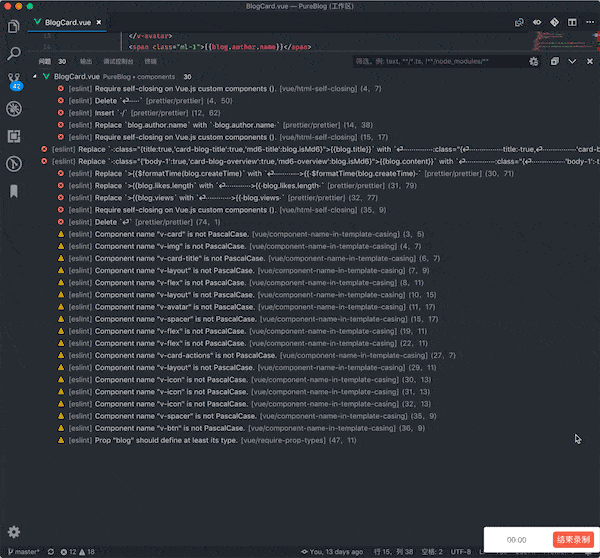
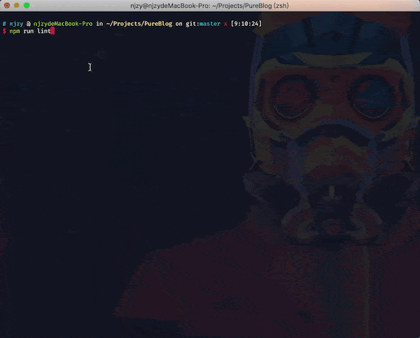
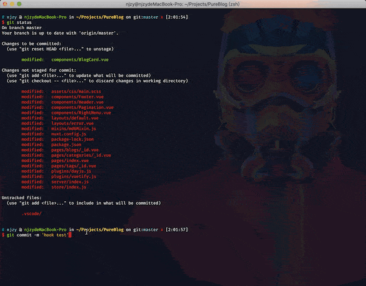

## 前言

开门见山，本教程主要是利用 npm 包(eslint+prettier+husky+lint-staged)和 vscode 插件(vetur+eslint+prettier)进行代码检查和格式化(如果使用了 vue-cli 自带的 eslint 规则，请自行参照修改)

## 效果

1. vscode 下格式化代码会自动利用 prettier+eslint 对 vue 整个文件，包括 template 部分进行检查和格式化。检查中出现的错误如果可以自动修复就自动修复，不用多次按保存键

   

2. 利用 npm scripts 对项目所有文件进行检查和一键修复错误+格式化

   

3. 在 git commit 时会对提交的文件代码进行检查，如果出现错误则终止 commit

   

## 效果一步骤

### 安装 npm 包

1. 首先安装必须使用的包

   ```bash
   npm install --save-dev babel-eslint eslint eslint-plugin-prettier eslint-config-prettier prettier
   ```

2. 由于是 vue 项目，这里我们安装 vue 官方的 eslint 插件

   ```bash
   npm install --save-dev eslint-plugin-vue
   ```

3. 此步可跳过，但为了更全面的检查代码，这里我们安装 standard 规则和其依赖项

   ```bash
   npm install --save-dev eslint-config-standard eslint-plugin-standard eslint-plugin-promise eslint-plugin-import eslint-plugin-node
   ```

### 安装 vscode 插件

- 搜索 vetur 安装(当前最新版本为 0.19.0)

- 搜索 eslint 安装

- 搜索 prettier 安装(为了防止冲突，如果安装了 Beautify 请将其禁用)

### 配置 eslint

项目根目录创建**.eslintrc.js**文件，规则部分这里不解释，我的配置如下(这里的规则主要参照[eslint-config-prettier](https://github.com/prettier/eslint-config-prettier))

```javascript
module.exports = {
  root: true,
  parserOptions: {
    parser: 'babel-eslint',
    sourceType: 'module',
    ecmaFeatures: {
      jsx: true,
    },
  },
  env: {
    browser: true,
    es6: true,
    node: true,
  },
  extends: ['standard', 'plugin:vue/recommended', 'prettier', 'prettier/standard', 'prettier/vue'],
  plugins: ['standard', 'vue', 'prettier'],
  rules: {
    'prettier/prettier': [
      'error',
      {
        htmlWhitespaceSensitivity: 'ignore',
        semi: false,
        singleQuote: true,
        printWidth: 120,
      },
    ],
    'vue/html-self-closing': [
      'error',
      {
        html: {
          void: 'any',
        },
      },
    ],
    'vue/no-use-v-if-with-v-for': ['off'],
    'vue/component-name-in-template-casing': ['off'],
    'vue/name-property-casing': ['off'],
    'vue/no-unused-components': ['off'],
    eqeqeq: ['off'],
    'no-new': ['off'],
  },
};
```

### 设置 vscode 插件

- vetur 设置

```json
"vetur.format.defaultFormatterOptions": {
  "prettier": {
    "htmlWhitespaceSensitivity": "ignore",
    "semi": false,
    "singleQuote": true,
    "printWidth": 120
  }
},
"vetur.format.defaultFormatter.html": "prettier",
"vetur.validation.template": false,
```

- eslint 设置

```json
"eslint.autoFixOnSave": true,
"eslint.validate": [
  "javascript",
  "javascriptreact",
   {
     "language": "vue",
     "autoFix": true
   }
],
```

- prettier 设置

```json
"prettier.disableLanguages": [],
"prettier.eslintIntegration": true,
```

至此代码检查和一键格式化文件并自动 fix 应该就能实现了

## 效果二步骤

### 配置 npm scripts

在**package.json**文件中添加下面的内容

```json
"scripts": {
  "lint": "eslint --ext .js,.vue ./;exit 0",
  "lint:fix": "eslint --fix --ext .js,.vue ./;exit 0",
  "eslint-check": "eslint --print-config . | eslint-config-prettier-check"
},
```

至此就能够一键检查项目所有文件和自动格式化修复了

## 效果三步骤

### 安装 npm 包

```bash
npm install --save-dev lint-staged husky
```

### 配置 lint-staged 和 husky

在**packages.json**文件中添加下面的内容

```bash
"husky": {
  "hooks": {
    "pre-commit": "lint-staged"
  }
},
"lint-staged": {
  "*.{js,vue}": "eslint"
},
```

至此就能够在 git commit 时对文件代码进行检查了

## 参考链接

- [eslint-plugin-prettier](https://github.com/prettier/eslint-plugin-prettier)
- [eslint-config-prettier](https://github.com/prettier/eslint-config-prettier)
- [eslint-plugin-vue](https://github.com/vuejs/eslint-plugin-vue)
- [eslint-config-standard](https://github.com/standard/eslint-config-standard)
- [husky](https://github.com/typicode/husky)
- [lint-staged](https://github.com/okonet/lint-staged)
