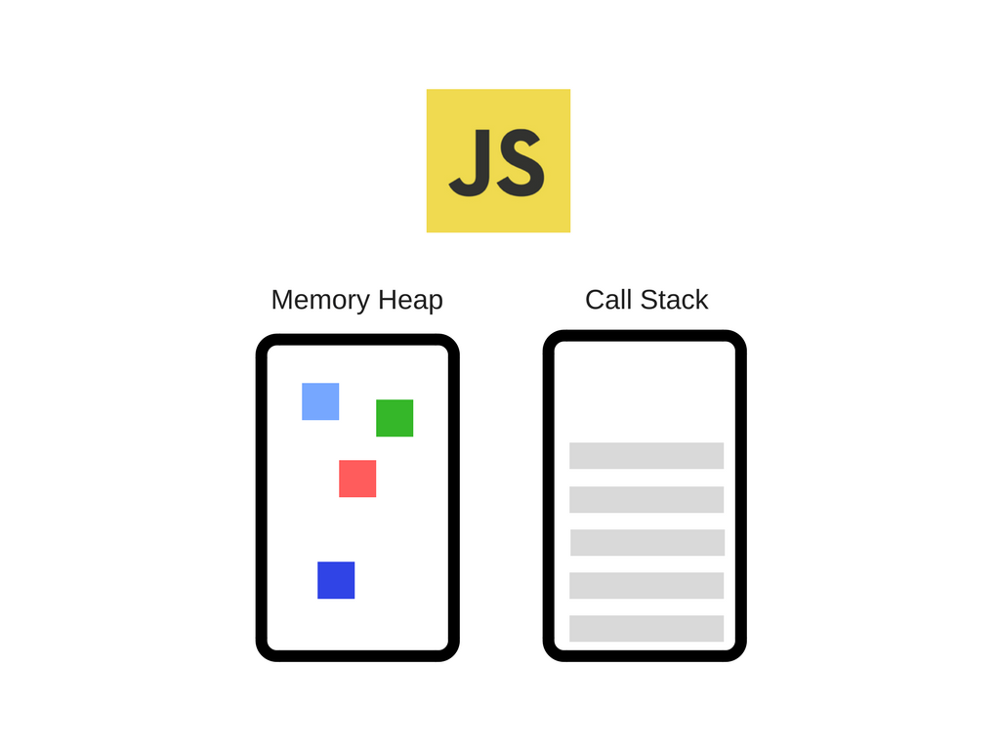
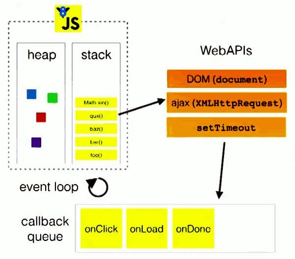
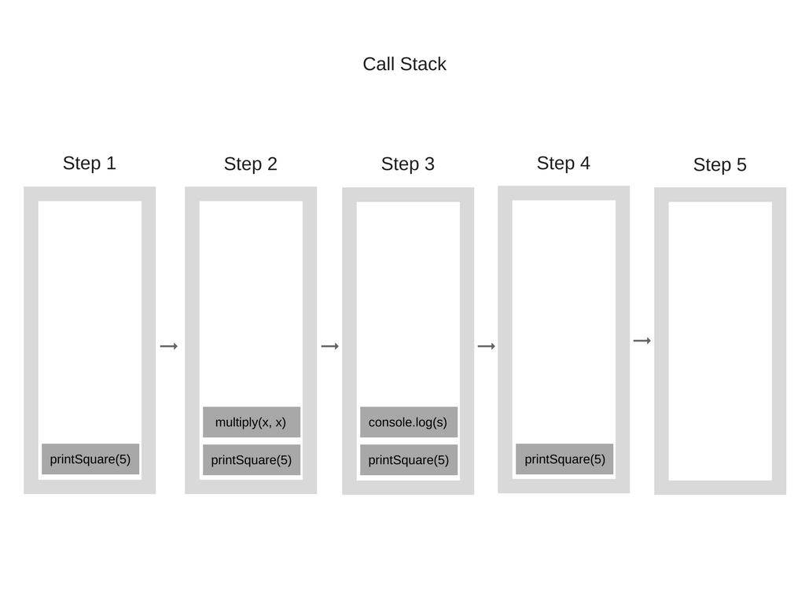
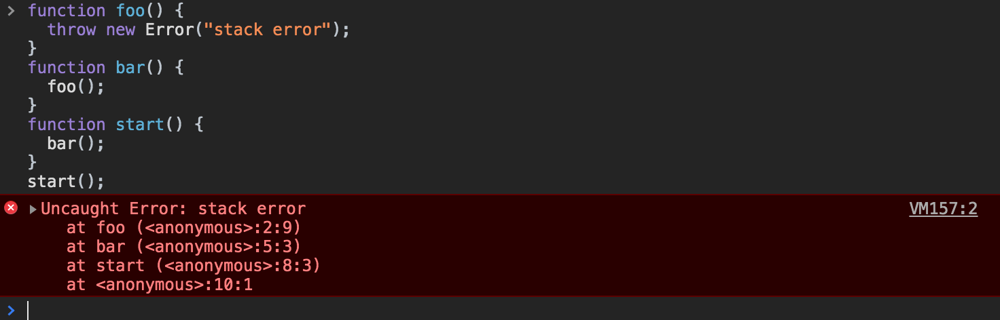
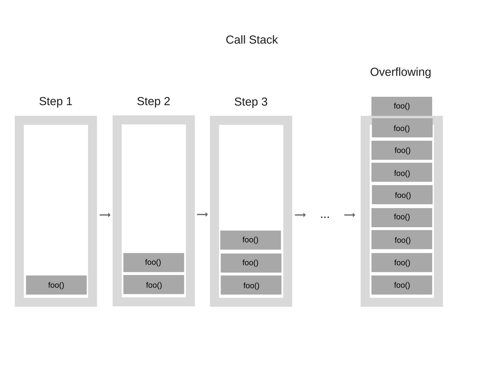
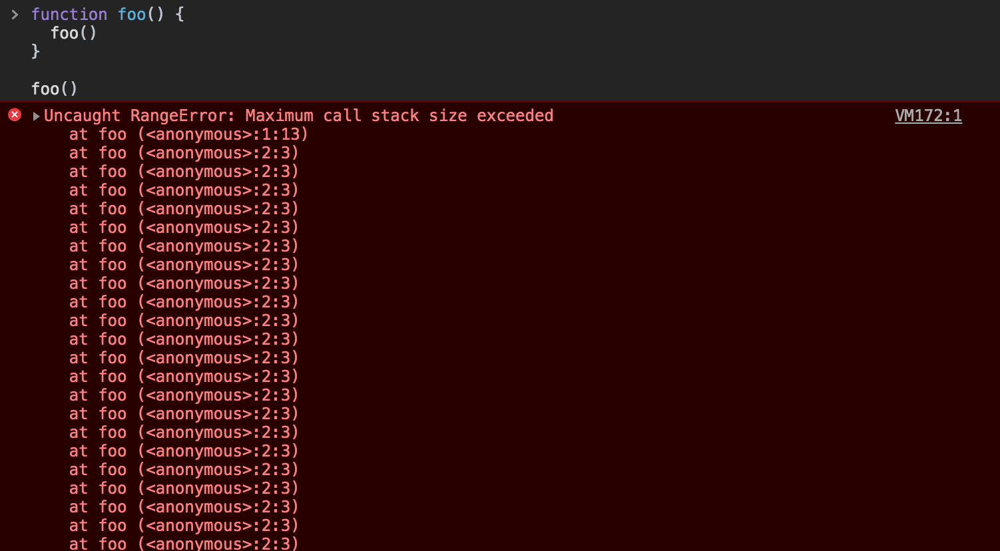
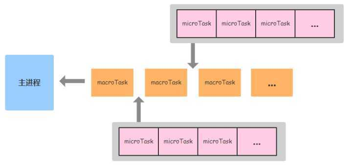
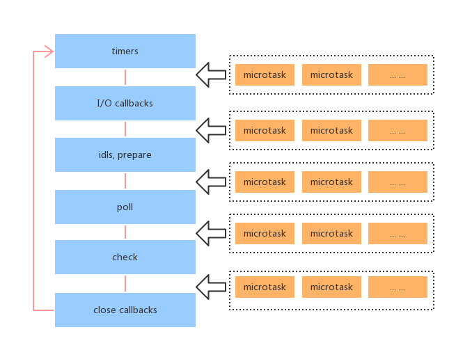

## 前言

网上介绍事件循环机制的文章很多，大家应该都有所了解，但是大部分文章都会有点问题，并且很多文章都是互相引用，这里我只推荐两篇文章，一篇是 whatwg 在 html 规范中关于事件循环的解释，一篇是 Jake（chrome 开发者）对微任务和宏任务的解释。这两篇文章篇幅很长，希望大家认真看完。html 规范那篇确实很晦涩难懂，但 Jake 那篇一定要看完，写的真的是太好了！！！那么我为什么还要写这篇文章呢，主要目的还是想根据自己的思路从头到尾梳理一遍，以加深对事件循环机制的理解。

- [html standard event loop](https://html.spec.whatwg.org/multipage/webappapis.html#event-loops)
- [Jake Tasks, microtasks, queues and schedules](https://jakearchibald.com/2015/tasks-microtasks-queues-and-schedules/)

对于英文不好的同学，Jake 那篇是有[译文](https://hongfanqie.github.io/tasks-microtasks-queues-and-schedules/)的。

## Show me the code

在理解事件循环机制之前，我们先来看一段代码：

```javascript
console.log('script start');
setTimeout(function () {
  console.log('setTimeout');
}, 0);
Promise.resolve()
  .then(function () {
    console.log('promise1');
  })
  .then(function () {
    console.log('promise2');
  });
console.log('script end');
```

运行结果？我们后面在详细分析。

## 重要概念

在正式介绍事件循环机制之前，有几个相关的重要概念我们先过一遍：

### 1. v8 引擎

> V8 是 Google 的开源高性能 JavaScript 和 WebAssembly 引擎，用 C ++编写。它用于 Chrome 和 Node.js 等。它实现 ECMAScript 和 WebAssembly，并在 Windows 7 或更高版本，macOS 10.12+以及使用 x64，IA-32，ARM 或 MIPS 处理器的 Linux 系统上运行。V8 可以独立运行，也可以嵌入到任何 C ++应用程序中。



v8 引擎主要有两大组件构成：

1. Memory Heap(内存堆)：内存分配发生的地方。
2. Call Stack(调用栈)：代码执行时堆栈帧所处的位置。

### 2. Runtime 运行时环境

我们在日常的开发中经常使用 Dom，Ajax，setTimeout 等 api，其实这些 api 并不是由 js 引擎提供的，它是由 js 的运行时环境提供的，目前主要是浏览器或者 Node。



由上图可以看出除了 js 引擎外，我们日常用到的 Dom 等方法都是来自于浏览器的 Web APIs，除此之外，浏览器还为我们提供了 Event Loop 事件循环机制和 Callback Quence 回调队列。

### 3. Call Stack 调用栈

众所周知，js 是单线程的，也就是说它只有一个 Call Stack 调用栈，同一时间只能做一件事情。

Call Stack 调用栈是一种数据结构，它使用后进先出（LIFO）原则来临时存储和管理函数调用。

---

```javascript
function multiply(x, y) {
  return x * y;
}
function printSquare(x) {
  var s = multiply(x, x);
  console.log(s);
}
printSquare(5);
```

当执行上述代码时，调用栈如图：



---

```javascript
function foo() {
  throw new Error('stack error');
}
function bar() {
  foo();
}
function start() {
  bar();
}
start();
```

当执行上述代码时，打开控制台你会看到一个错误并得到当前的调用栈：



---

```javascript
function foo() {
  foo();
}

foo();
```

当执行上述代码时，会出现堆栈溢出的问题：



打开控制台会得到如下错误：



## Event Loop 事件循环机制

事件循环机制是一种**解决 js 单线程运行时不会阻塞的一种机制，也就是异步的实现原理**。它跟 js 引擎是没有多大关系的，它主要是由 js 运行时环境来实现的，所以事件循环机制也就分为浏览器和 Node 事件循环机制。

PS: 为什么会说跟 js 引擎没多大关系而不是一点关系没有，是因为在 es6 出现后，我们可以使用 promise 语法做一些异步操作并且在 ecmascript 规范中还出现了 job 的概念，而之前的事件循环机制是在 html 规范中定义的，所以两者是存在一定区别的。

### 浏览器事件循环机制

我们先从浏览器事件循环机制说起：


#### 1. Callback Quence 回调队列

回调队列也叫做 Task Quence 任务队列。当调用栈执行异步任务时并不会一直等待其返回结果，而是会继续执行调用栈的其他任务。当异步任务有结果时会将异步任务注册的回调函数放入到任务队列中。

#### 2. Event-Loop

被放入任务队列中的函数并不会立即执行，而是等待当前调用栈中的所有任务都执行完毕（调用栈为空），主线程处于空闲状态时，主线程会去看任务队列是否有任务。如果有，那么主线程会将任务队列中的第一个任务放入调用栈中并执行，执行结束后，调用栈为空，主线程为空闲状态，这样就完成了一次事件循环。

#### 3. 宏任务与微任务

上面是对事件循环的宏观介绍，实际上除了任务队列还存在一个微任务队列 Micro Task Queue。为了与之对应，任务队列也可以称之为宏任务队列 Macro Task Queue。

`Task == MacroTask != MicroTask`

PS：根据 html 规范定义，宏任务队列有一个或多个，微任务队列只有一个，并且宏任务是会根据任务源进行分配的，一个宏任务队列中的任务都是属于同一个任务源。

##### MacroTask(宏任务)

宏任务主要包含：`script，setTimeout, setInterval, setImmediate, requestAnimationFrame, I/O, UI rendering`

PS：这里的 script 是指加载 js 脚本时执行的任务，如果有两个`<script src=...></script>`，就会有两个宏任务。

##### MicroTask(微任务)

微任务主要包含：`process.nextTick(node环境中存在), Promise, Object.observe, MutationObserver`

#### 4. 事件循环进程模型

实际在调用栈为空，主线程空闲时，主线程首先回去查看微任务队列是否为空，如果为空则执行 ui 渲染任务，此时一次事件循环结束，然后是紧接着下一次事件循环。如果微任务队列不为空则将微任务队列中的第一个任务作为此次事件循环要执行的任务压入调用栈并执行，直至微任务队列为空时，执行 ui 渲染任务，此时一次事件循环结束。下一次事件循环从宏任务队列里的第一个宏任务开始。

详细过程如下：

1. 选择当前要执行的宏任务队列，选择宏任务队列中最先进入的任务，如果宏任务队列为空即 null，则执行跳转到微任务（MicroTask）的执行步骤 6
2. 将事件循环中的任务设置为已选择任务
3. 执行任务
4. 将事件循环中当前运行任务设置为 null
5. 将已经运行完成的任务从任务队列中删除
6. 微任务执行步骤：进入 microtask 微任务检查点
7. 更新界面渲染
8. 返回第一步

执行进入 microtask 检查点时会执行以下步骤：

1. 如果微任务检查点为 true 则 return，不执行以下步骤
2. 设置微任务检查点标志为 true
3. 如果微任务队列不为空：
   1. 选择一个最先进入的微任务队列的任务
   2. 将事件循环中的任务设置为已选择的微任务
   3. 执行任务
   4. 将事件循环中当前执行的任务设置为 null
4. 清理 IndexDB 事务
5. 设置微任务检查点的标志为 false



**总的来说就是在每一次宏任务执行完成后，ui 渲染任务之前，微任务队列中的任务会全部执行结束，微任务队列为空。**

---

现在我们来看之前的代码：

```javascript
console.log('script start');
setTimeout(function () {
  console.log('setTimeout');
}, 0);
Promise.resolve()
  .then(function () {
    console.log('promise1');
  })
  .then(function () {
    console.log('promise2');
  });
console.log('script end');
```

正确的运行结果是：

```bash
script start
script end
promise1
promise2
setTimeout
```

整个事件循环流程如下：

1. 加载代码作为宏任务 run script 进入宏任务队列
2. 此时调用栈为空，宏任务队列里的第一个任务将作为此次事件循环要执行的任务被压入调用栈并执行
3. 遇到 console.log 同步代码直接执行，输出 script start
4. 遇到 settimeout，将 settimeout callback 放入宏任务队列
5. 遇到 promise，将 promise.then 放入微任务队列
6. 遇到 console.log 同步代码直接执行，输出 script end
7. 此时同步代码全部执行完成，调用栈为空，主线程处于空闲状态
8. 检查微任务队列是否为空，发现不为空存在 promise.then，将 promise.then 回调压入调用栈开始执行并输出 promise1
9. 执行后再次产生 promise.then，将其放入微任务队列中，移除上一个微任务
10. 调用栈为空检查微任务队列是否为空，不为空，将 promise.then 回调压入调用栈开始执行并输入 promise2
11. 执行结束，调用栈为空，微任务队列也为空，宏任务 run script 执行结束，从宏任务队列中移除，本次事件循环结束
12. 开始下一次事件循环，将宏任务队列的第一个任务也就是 settimeout callback 压入调用栈中并执行，输出 settimeout

#### 5. 小结

1. 调用栈在执行任务时会将异步任务放到任务队列中然后去执行其他同步任务，当调用栈为空时再回来执行任务队列中的任务
2. 任务队列也叫做宏任务队列，有一个或多个，每个宏任务队列里的任务都属于同一个任务源
3. 除了宏任务队列外，还有一个微任务队列，在每次宏任务执行完成后，会将微任务队列里的任务全部执行完成后才会去执行下一个宏任务
4. 代码首次执行时是被作为宏任务放入宏任务队列中的

### Node 事件循环机制

#### 1. 与浏览器环境有何不同

Node 中的 Event Loop 是基于 libuv 实现的，而 libuv 是 Node 的新跨平台抽象层，libuv 使用异步，事件驱动的编程方式，核心是提供 i/o 的事件循环和异步回调。libuv 的 API 包含有时间，非阻塞的网络，异步文件操作，子进程等等。
Event Loop 就是在 libuv 中实现的。

#### 2. 事件循环模型

下面是一个 libuv 引擎中的事件循环的模型:

```bash
   ┌───────────────────────────┐
┌─>│           timers          │
│  └─────────────┬─────────────┘
│  ┌─────────────┴─────────────┐
│  │     pending callbacks     │
│  └─────────────┬─────────────┘
│  ┌─────────────┴─────────────┐
│  │       idle, prepare       │
│  └─────────────┬─────────────┘      ┌───────────────┐
│  ┌─────────────┴─────────────┐      │   incoming:   │
│  │           poll            │<─────┤  connections, │
│  └─────────────┬─────────────┘      │   data, etc.  │
│  ┌─────────────┴─────────────┐      └───────────────┘
│  │           check           │
│  └─────────────┬─────────────┘
│  ┌─────────────┴─────────────┐
└──┤      close callbacks      │
   └───────────────────────────┘
```

注：模型中的每一个方块代表事件循环的一个阶段

#### 3. 阶段概述

1. timers: 本阶段执行已经安排的 setTimeout() 和 setInterval() 的回调函数。
2. pending callbacks: 执行延迟到下一个循环迭代的 I/O 回调。
3. idle, prepare: 仅系统内部使用。
4. poll: 检索新的 I/O 事件;执行与 I/O 相关的回调（几乎所有情况下，除了关闭的回调函数，它们由计时器和 setImmediate() 排定的之外），其余情况 node 将在此处阻塞。
5. check: setImmediate() 回调函数在这里执行。
6. close callbacks: 一些准备关闭的回调函数，如：socket.on('close', ...)。

我们重点看 timers、poll、check 这 3 个阶段就好，因为日常开发中的绝大部分异步任务都是在这 3 个阶段处理的。

##### timers

timers 是事件循环的第一个阶段，Node 会去检查有无已过期的 timer，如果有则把它的回调压入 timer 的任务队列中等待执行，事实上，Node 并不能保证 timer 在预设时间到了就会立即执行，因为 Node 对 timer 的过期检查不一定靠谱，它会受机器上其它运行程序影响，或者那个时间点主线程不空闲。比如下面的代码，setTimeout() 和 setImmediate() 的执行顺序是不确定的。

```javascript
setTimeout(() => {
  console.log('timeout');
}, 0);

setImmediate(() => {
  console.log('immediate');
});
```

但是把它们放到一个 I/O 回调里面，就一定是 setImmediate() 先执行，因为 poll 阶段后面就是 check 阶段。

##### poll

轮询阶段有两个重要的功能：

- 处理 poll 队列的事件
- 当有已超时的 timer，执行它的回调函数

even loop 将同步执行 poll 队列里的回调，直到队列为空或执行的回调达到系统上限（上限具体多少未详），接下来 even loop 会去检查有无预设的 setImmediate()，分两种情况：

1. 若有预设的 setImmediate(), event loop 将结束 poll 阶段进入 check 阶段，并执行 check 阶段的任务队列
2. 若没有预设的 setImmediate()，event loop 将阻塞在该阶段等待

注意一个细节，没有 setImmediate()会导致 event loop 阻塞在 poll 阶段，这样之前设置的 timer 岂不是执行不了了？所以咧，在 poll 阶段 event loop 会有一个检查机制，检查 timer 队列是否为空，如果 timer 队列非空，event loop 就开始下一轮事件循环，即重新进入到 timer 阶段。

##### check

setImmediate()的回调会被加入 check 队列中， 从 event loop 的阶段图可以知道，check 阶段的执行顺序在 poll 阶段之后。

#### 4. 小结

- event loop 的每个阶段都有一个任务队列
- 当 event loop 到达某个阶段时，将执行该阶段的任务队列，直到队列清空或执行的回调达到系统上限后，才会转入下一个阶段
- 当所有阶段被顺序执行一次后，称 event loop 完成了一个 tick

### Node.js 与浏览器的 Event Loop 差异

浏览器环境下，microtask 的任务队列是每个 macrotask 执行完之后执行。


而在 Node.js 中，microtask 会在事件循环的各个阶段之间执行，也就是一个阶段执行完毕，就会去执行 microtask 队列的任务。



总结：

- Node.js 的事件循环分为 6 个阶段
- 浏览器和 Node 环境下，microtask 任务队列的执行时机不同
- Node.js 中，microtask 在事件循环的各个阶段之间执行
- 浏览器端，microtask 在事件循环的 macrotask 执行完之后执行
- 递归的调用 process.nextTick()会导致 I/O starving，官方推荐使用 setImmediate()

## 参考链接

- [Tasks, microtasks, queues and schedules](https://jakearchibald.com/2015/tasks-microtasks-queues-and-schedules/)
- [html standard event-loops](https://html.spec.whatwg.org/multipage/webappapis.html#event-loops)
- [How JavaScript works: an overview of the engine, the runtime, and the call stack](https://blog.sessionstack.com/how-does-javascript-actually-work-part-1-b0bacc073cf)
- [How JavaScript works: Event loop and the rise of Async programming + 5 ways to better coding with async/await](https://blog.sessionstack.com/how-javascript-works-event-loop-and-the-rise-of-async-programming-5-ways-to-better-coding-with-2f077c4438b5)
- [详解 JavaScript 中的 Event Loop（事件循环）机制](https://zhuanlan.zhihu.com/p/33058983)
- [一次弄懂 Event Loop](https://juejin.im/post/5c3d8956e51d4511dc72c200)
- [深入理解 js 事件循环机制（Node.js 篇）](http://lynnelv.github.io/js-event-loop-nodejs)
- [不要混淆 nodejs 和浏览器中的 event loop](https://cnodejs.org/topic/5a9108d78d6e16e56bb80882)
- [Node.js 事件循环，定时器和 process.nextTick()](https://nodejs.org/zh-cn/docs/guides/event-loop-timers-and-nexttick/)
