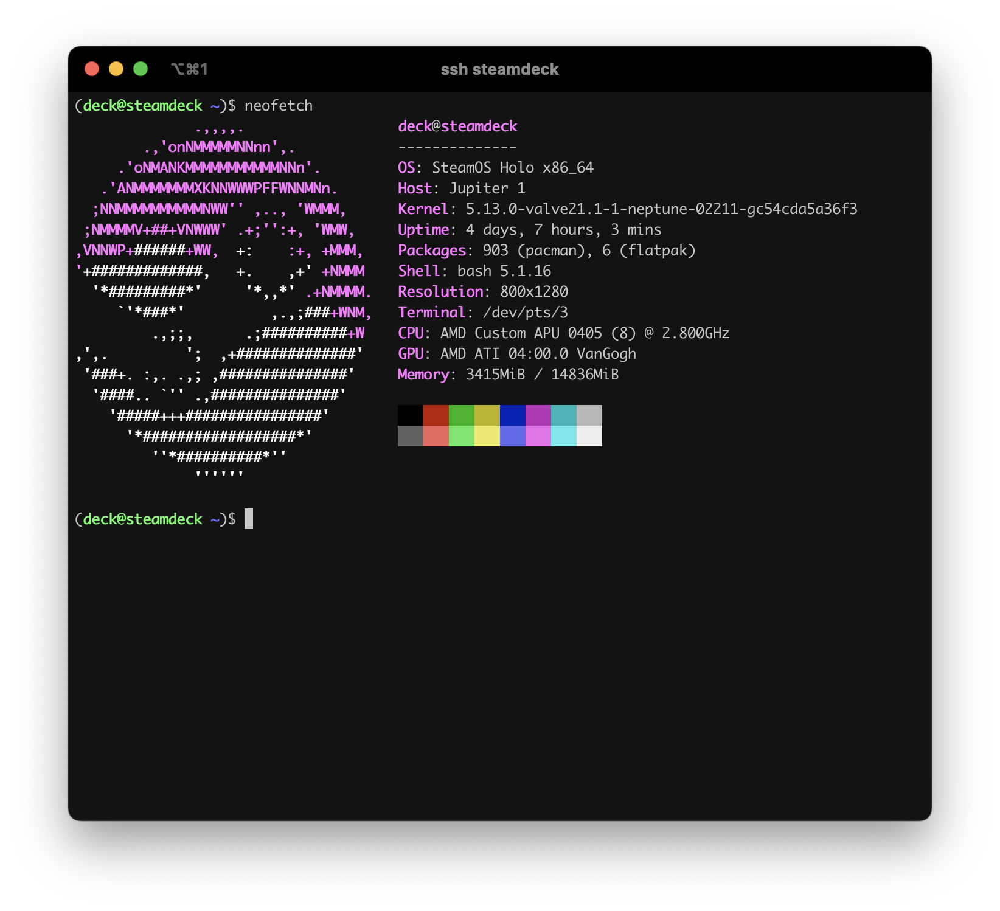

首先需要切换到桌面模式并打开 `Konsole` 终端

## 密码设置

因为默认登录的账号 `deck` 没有设置密码，我们需要手动设置，终端执行以下命令：

```bash
passwd
```

上面设置的是当前登录用户 `deck` 的密码，我们同时可以设置 `root` 的密码:

```bash
passwd root
```

## 开启 SSH

密码设置完成后，我们执行以下命令开启 `ssh`:

```bash
systemctl enable sshd
systemctl start sshd
```

开启成功后，我们可以执行以下命令查看 `ssh` 状态：

```bash
systemctl status sshd
```

**Active** 显示 **running** 即代表启动成功

```bash
● sshd.service - OpenSSH Daemon
     Loaded: loaded (/usr/lib/systemd/system/sshd.service; enabled; vendor preset: disabled)
     Active: active (running) since Mon 2022-10-03 10:37:59 CST; 3h 20min ago
   Main PID: 73134 (sshd)
      Tasks: 1 (limit: 17714)
     Memory: 10.2M
        CPU: 1.521s
     CGroup: /system.slice/sshd.service
             └─73134 "sshd: /usr/bin/sshd -D [listener] 0 of 10-100 startups"
```

此时我们就可以通过电脑进行连接：

```bash
# IP为当前 steamdeck 的 IP，可以在网络连接中查看
# 回车之后输入之前设置的密码即可
ssh deck@IP
```

## 安装 Docker

为了获取磁盘完整的读写权限，我们需要关闭系统默认的只读模式

```bash
sudo steamos-readonly disable
```

执行以下命令刷新 Package 并初始化相关密钥:

```bash
# Refresh
sudo pacman -Ssy
# Initialize the pacman keyring
sudo pacman-key --init
# Populate the pacman keyring with the default Arch Linux keys
sudo pacman-key --populate archlinux
```

完成上述操作后，我们便可以安装 `Docker`:

```bash
sudo pacman -S docker docker-compose
```

设置非 root 账号:

```bash
# 添加 docker 用户组
sudo groupadd docker
# 将当前用户添加到 docker 用户组
sudo usermod -aG docker $USER
# 激活 docker 用户组
newgrp docker
```

启用并设置开机自启:

```bash
systemctl enable docker
systemctl start docker
```
