以老滚5 为例，手把手教你如何给 SteamDeck 上的游戏打 Mod，更确切的说是给 steamos 上的游戏打 Mod

**PS** 本教程主要教你如何拥有一个可以给 steamos 上的游戏打 MOD 的环境，然后带你简单走一遍 MOD 安装流程，至于更进阶的使用大家可以看 B 站上相关的教程

## 准备工作

首先我们要能访问 steamos 里的游戏目录，这里大家需要按照我这个教程 [SteamDeck 开启 Samba 实现文件共享](../steamdeck-smba/index.md) 进行操作, **教程最后一步 Windows 映射网络驱动器 一定要照做**，操作完成之后我们就可以访问游戏目录了：


## SKSE

给老滚 5 打 MOD，[SKSE](https://skse.silverlock.org/) 属于前置工具，我们只需要访问官网下载对应的版本即可，版本号我们可以选中 `SkyrimSE` 文件鼠标右键查看 ，我这里是最新的周年纪念版，版本号为 1.6.640


我们下载好 SKSE 并将其中的内容直接复制到游戏根目录即可完成安装, **因为打完 MOD 后必须通过 `skse64_loader` 启动游戏，所以我们这里需要将之前的 `SkyrimSELauncher` 文件备份，之后复制一份 `skse64_loader` 出来改名为 `SkyrimSELauncher` 即可**

**PS** 这里只所以不直接重命名 `skse64_loader` 文件是因为 Mod 管理器会检测这个文件来判断 `skse` 是否正常安装


## Mod 管理器

现在主流的 Mod 管理器基本只能在 Windows 上使用，原生支持 linux 的我目前还不太了解，所以我这里还是会使用 Windows 上的 Mod 管理器，所以我们需要一台 PC 或者虚拟机里跑 Windows 系统，我这里就是在 macOS 里挂的虚拟机跑的 Windows

**PS** 如果你们想全程在 SteamDeck 上安装 Mod 而不用到 PC，可以看油管这个教程 [Steam Deck Skyrim Mod Guide | Mod Organizer 2 Native](https://www.youtube.com/watch?v=x55SAwnONbQ)，我自己觉得那样操作体验不太好且后续遇到问题很难排查，所以我这里更倾向在 PC 上进行操作

目前主流的 Mod 管理器主要有以下几个：

- [Mod Organizer 2](https://github.com/ModOrganizer2/modorganizer) - 简称 MO
- [Nexus-Mod-Manager](https://github.com/Nexus-Mods/Nexus-Mod-Manager) - 简称 NMM
- [Vortex](https://www.nexusmods.com/about/vortex) - Nexusmods 自家开源的 Mod 管理器

上面几个管理器我都尝试了一遍，**除了 `Vortex` 其他两个都不能搭配 `Steamos` 正常使用，因为 `MO` 和 `NMM` 都是采用虚拟文件夹的形式安装 `MOD` 且必须通过他们启动 `SKSE` 才能进入游戏，而 Vortex 是通过文件硬链接的形式安装 MOD，在经过我们特殊的文件夹映射后，我这里测试功能基本都可以正常使用，包括存档备份、配置文件修改、 loot 排序和多配置文件切换，所以我这里最终使用 Vortex 作为 Mod 管理器**

### 映射游戏相关文件夹

在安装 Mod 管理器之前，我们首先需要将游戏的存档目录和配置目录挂载到本地电脑上，对于老滚5，我们需要保证本地电脑的以下目录可以正常访问 steamos 里对应的目录：

- `C:\Users\用户名\Documents\My Games\Skyrim Special Edition` - 此目录主要存放存档和游戏设置
- `C:\Users\用户名\AppData\Local\Skyrim Special Edition` - 此目录主要存放 `plugins.txt`

**PS** 如果你跟我一样用的虚拟机是 `ParallesDesktop` , 那 `Windows` 默认的 `Documents` 目录会被映射到 `macOS` 自身的 `Documents` 目录，这里建议在设置里进行关闭：

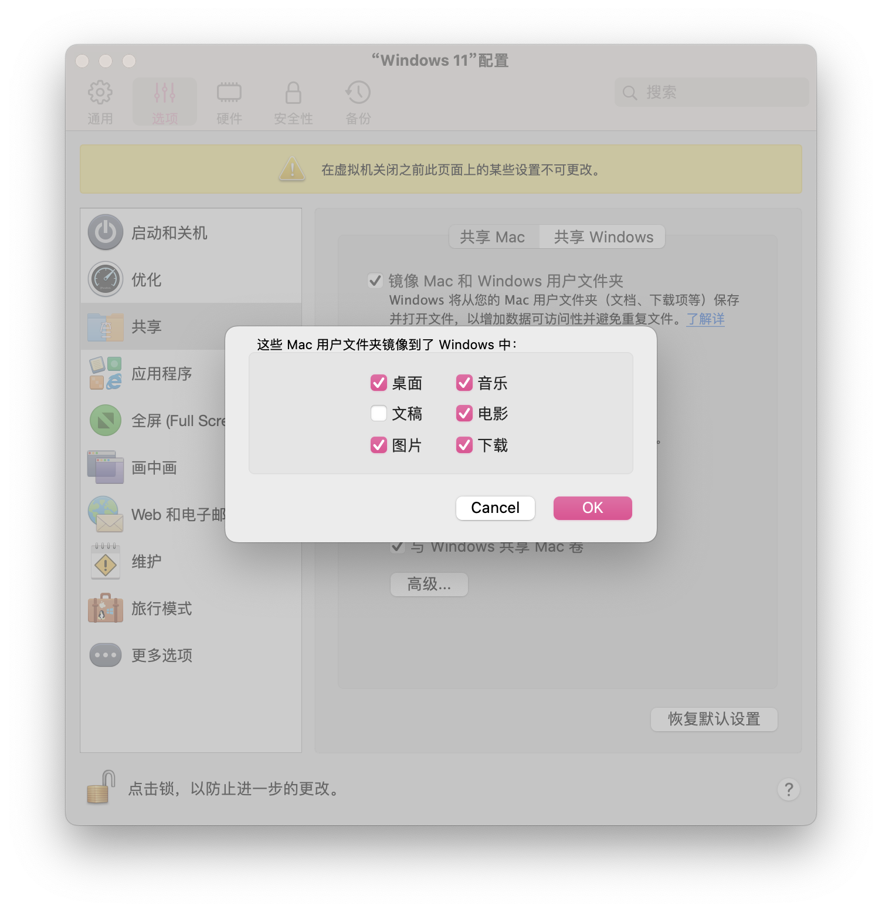
之后我们以管理员身份打开终端程序，注意这里不是 PowerShell ：

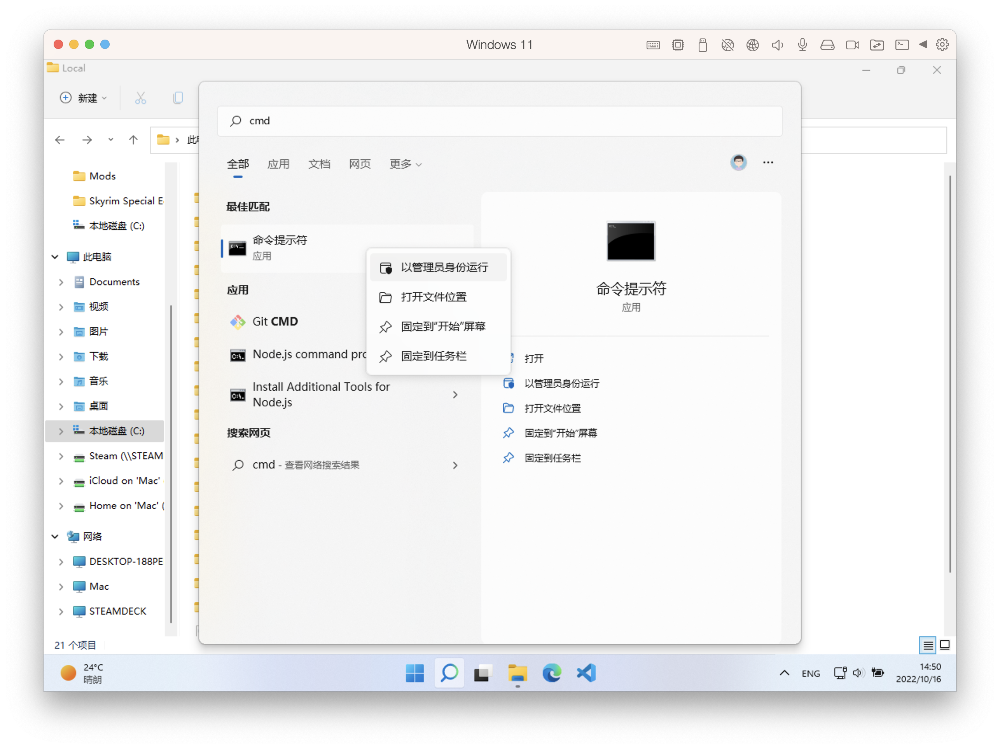
然后执行以下两条命令（**用户名根据自身情况进行替换**）便可以将 steamos 内的老滚5 相关的游戏目录全部映射到本地电脑上:

```bash
# Documents 目录 如果你本地电脑的 Documents 目录不存在 My Games 文件夹需要先手动创建
mklink /d "C:\Users\用户名\Documents\My Games\Skyrim Special Edition" "S:\steamapps\compatdata\489830\pfx\drive_c\users\steamuser\Documents\My Games\Skyrim Special Edition"
# AppData 目录
mklink /d "C:\Users\用户名\AppData\Local\Skyrim Special Edition" "S:\steamapps\compatdata\489830\pfx\drive_c\users\steamuser\AppData\Local\Skyrim Special Edition"
```

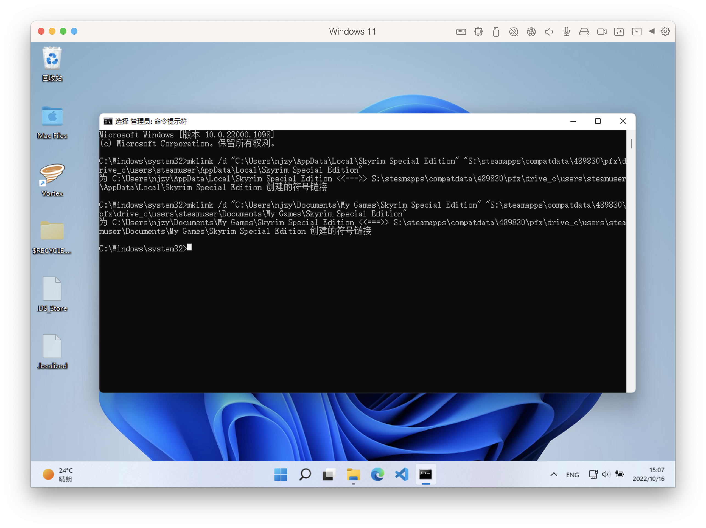
命令执行完成后，我们就可以在文件管理器看到相关目录已经带有箭头标识了：

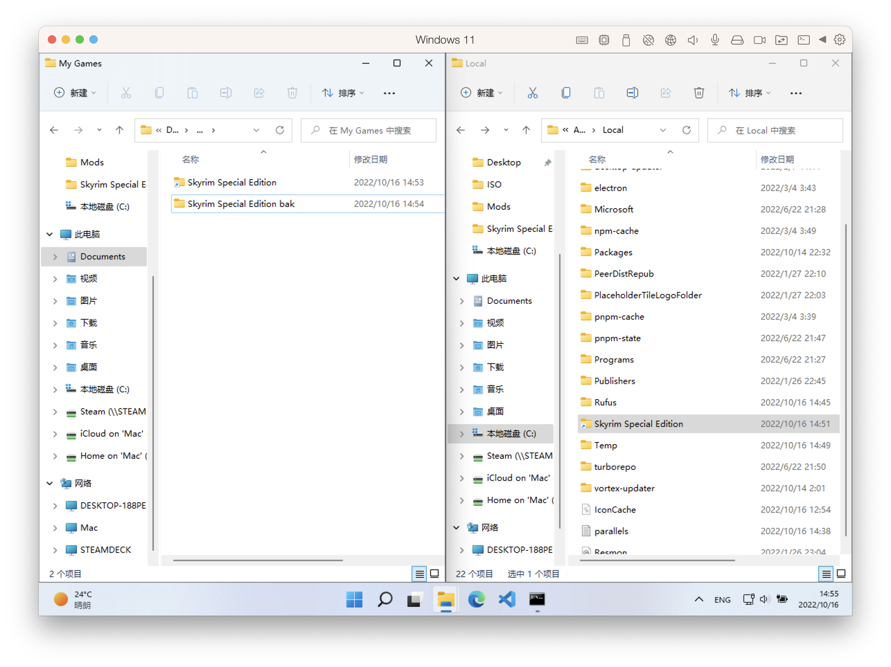
最后运行游戏一次确保我们可以在 `Documents\My Games\Skyrim Special Edition` 内看到相关的 `ini` 配置文件

### 设置 Vortex

我们从[官网](https://www.nexusmods.com/about/vortex)下载安装并启动，首先进入设置页面切换语言：

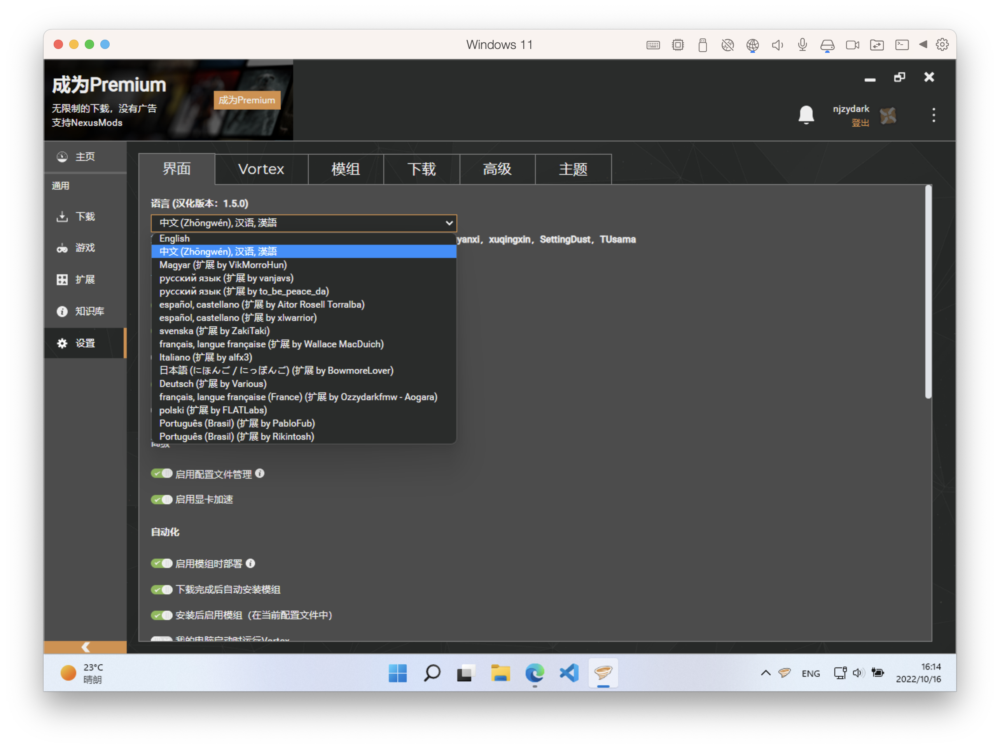
然后我们切换到游戏页面添加游戏，这里我们直接搜索就可以找到老滚5：

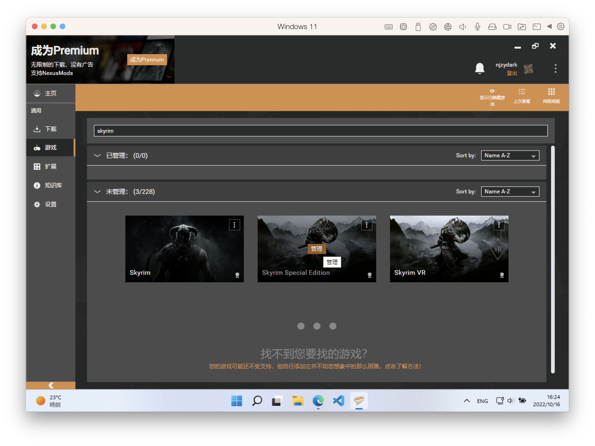
点击管理添加游戏目录：

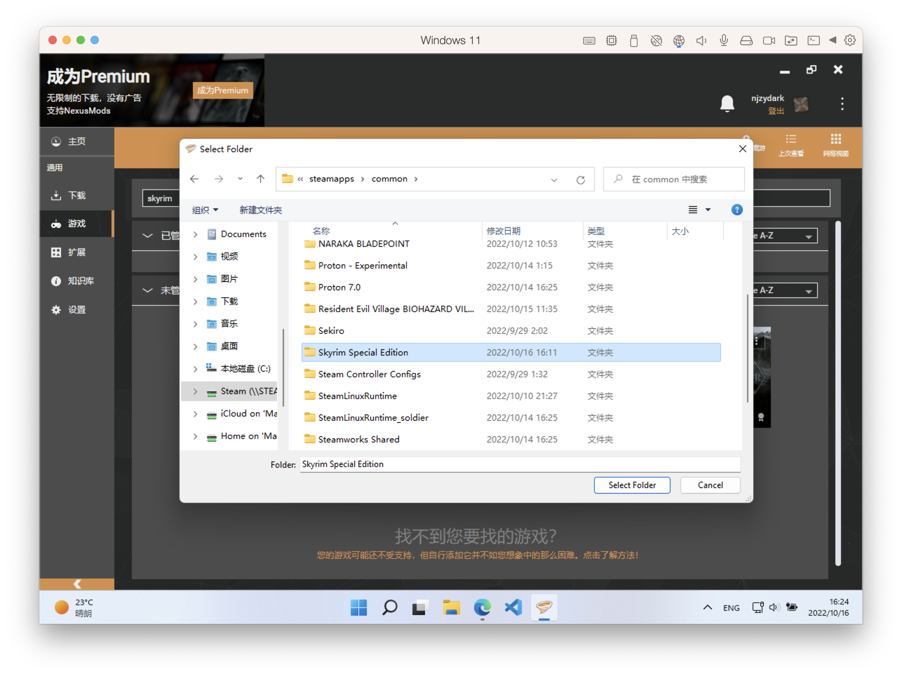
之后我们进入 `设置 -> 模组` 页面，这里我们点击建议按钮，不出意外它会直接绑定到我们通过 smb 挂载的 steam 目录，点击应用即可生效

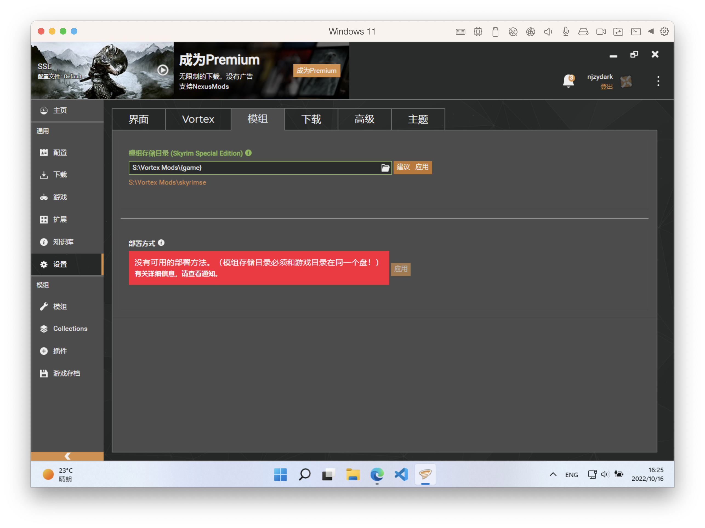
之后我们重启 `vortex` ，此时如果出现以下提示，我们之间点击修复即可：

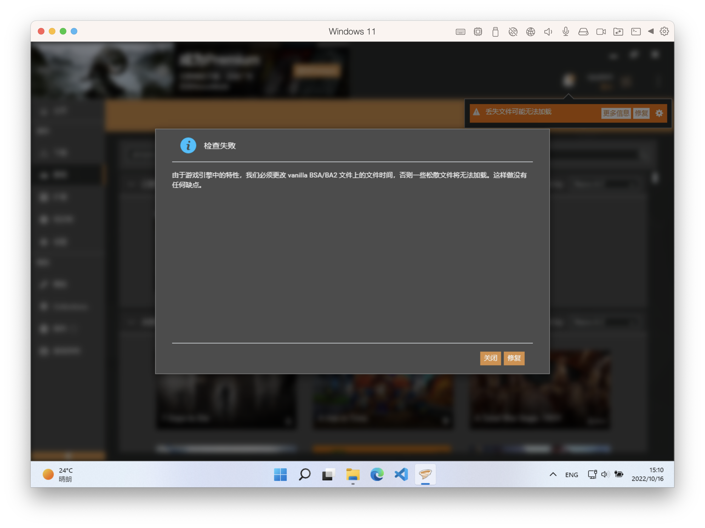
至此我们就完成了 `Vortex` 相关的设置

## Mod 安装

通过上面的设置，你基本就已经拥有了可以给 steamos 上的游戏打 MOD 的环境，关于工具具体的使用方法大家可以看 B 站上相关的视频教程，下面我简单介绍下如何在线安装 Mod

这里以 [SkyUI)](https://www.nexusmods.com/skyrimspecialedition/mods/12604) 为例, 我们首先进入 Mod 主页

`DESCRIPTION` - 描述 Tab 这里我们要查看其要求的前置依赖，这里它就依赖 `skse` ，所以我们在安装这个 Mod 之前要确保 `skse` 也已安装完成

`FILES` - 文件 Tab 这里主要提供 Mod 相关的下载文件

我们选择 `MOD MANAGER DOWNLOAD` 即可使用 `vortex` 在线下载安装，后者为手动下载安装

下载完成后，`vortex` 会自动帮你安装部署 `MOD` , 同时也会自动帮你排序插件，我们可以在插件页面可到最终的排序结果：

这样一个简单的 MOD 安装流程就结束了，最后我们在 Steam Deck 上运行游戏就可以验证 MOD 是否生效了，这是我打上 SKY UI 的效果：


## Vortex 多配置切换

这里我重点介绍一下 `vortex` 的多配置切换功能，应为它真的非常实用，我们可以借助此功能来测试 Mod

首先我们确保主页下的配置文件管理处于打开的状态

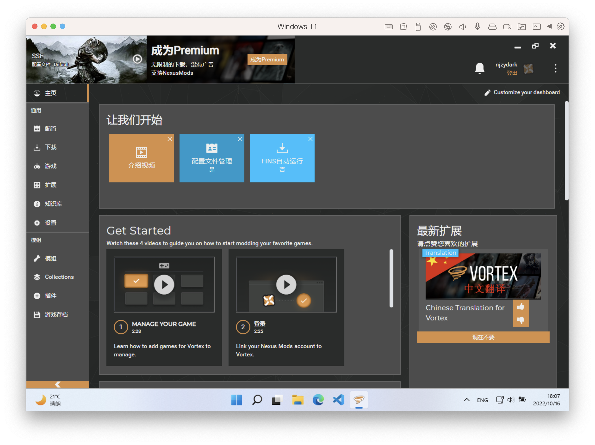

然后我们进入配置页面，这里我们可以新增配置、克隆当前配置，我这里我选择新增配置, 其中使用现有的游戏存档和游戏设置，这里大家可以根据自己的需求灵活调整，如果你选择有它自己的存档，那你进入游戏就需要从头开始

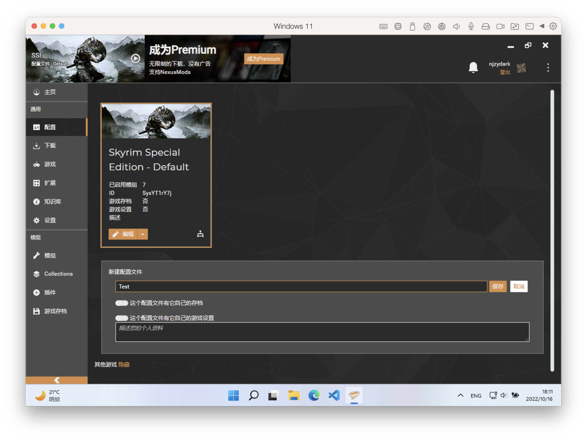

保存之后我们点击启用按钮, 这里切换成功后，`vortex` 会自动帮你进行部署，同时模组列表页会禁用你之前所有已下载的 Mod ，此时我们启动游戏就会发现它现在是一个纯净的状态，没有任何Mod

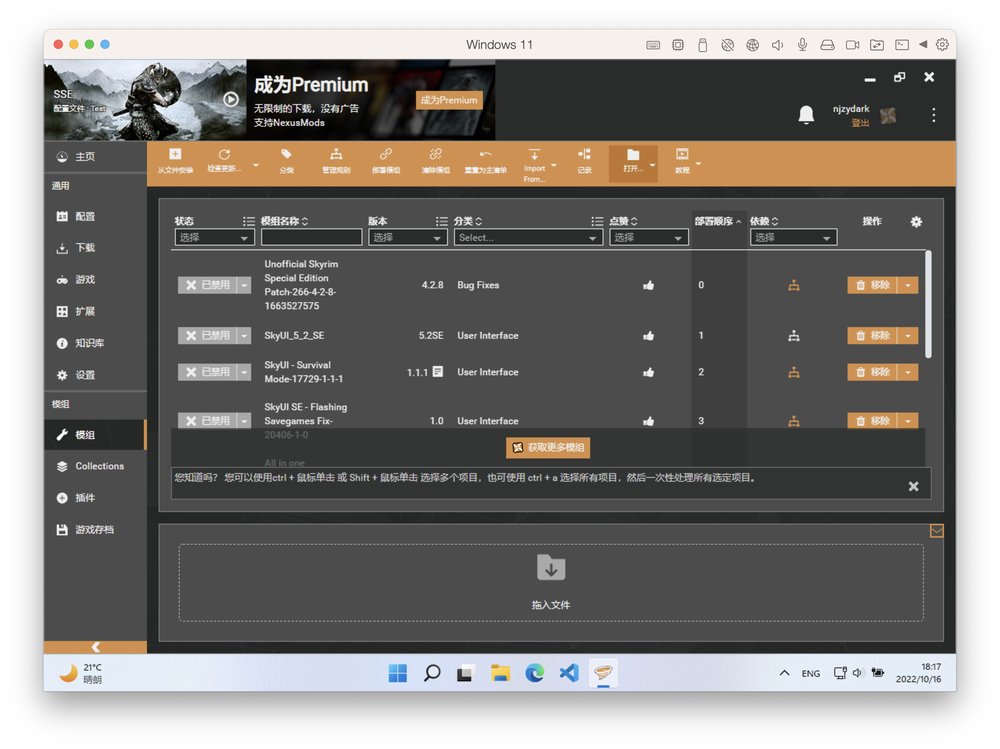


