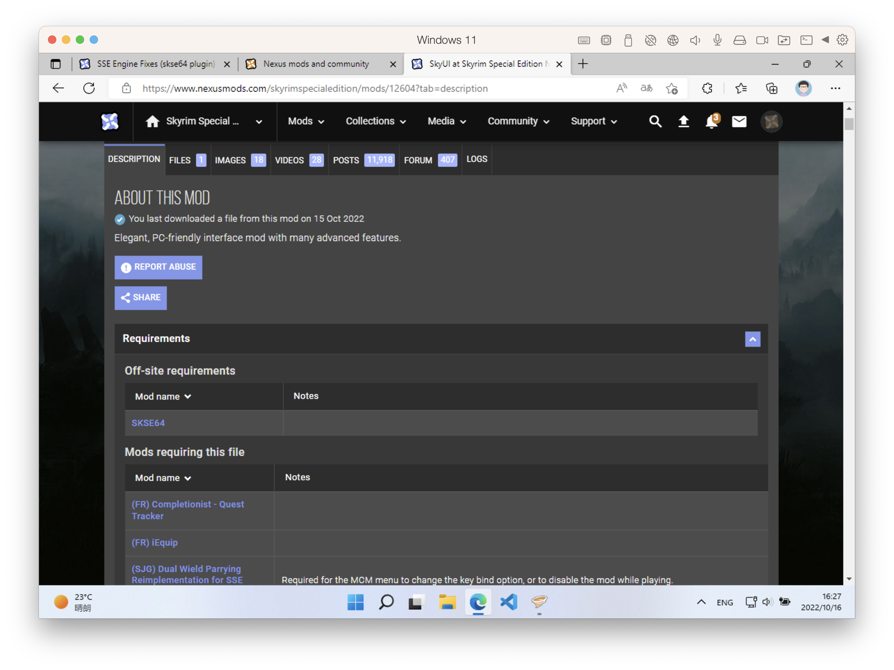
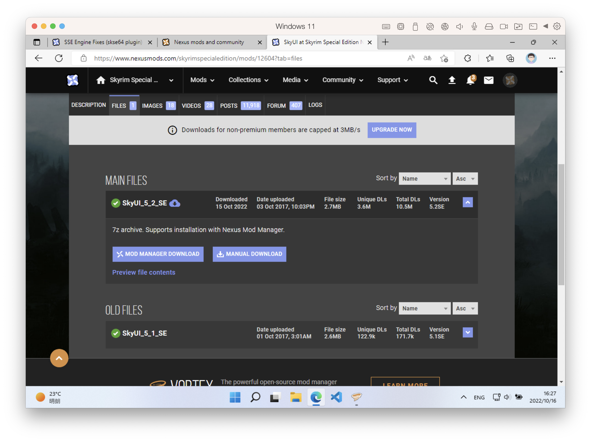
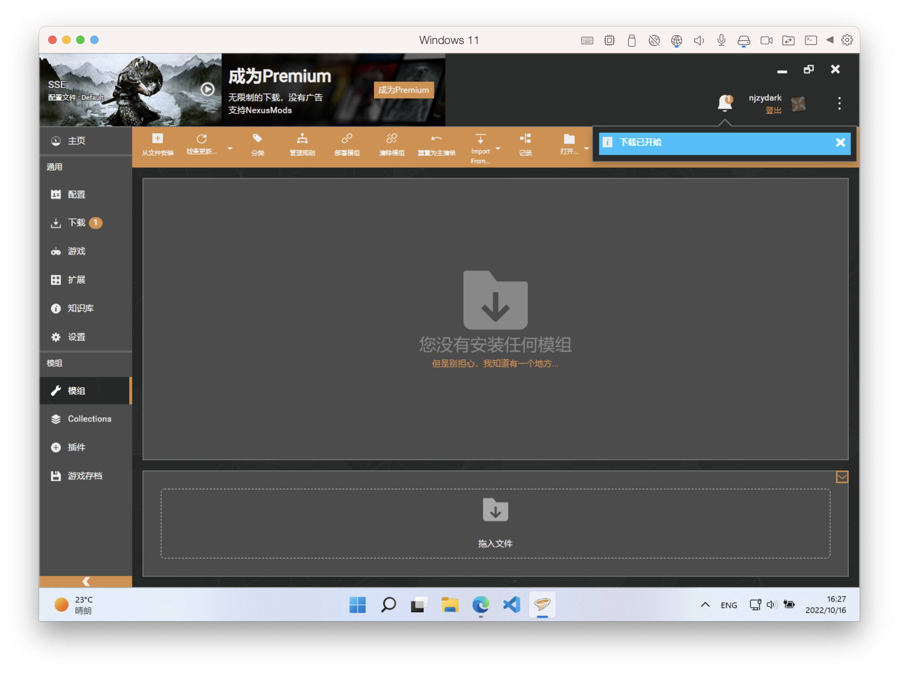

以老滚5为例，手把手教你如何给 SteamDeck 上的游戏打 Mod，更确切的说是给 steamos 上的游戏打 Mod

**PS** 本教程主要教你如何拥有一个可以给 steamos 上的游戏打 MOD 的环境，然后带你简单走一遍 MOD 安装流程，至于更进阶的使用大家可以看 B 站上相关的教程

## 准备工作

首先我们要能访问 steamos 里的游戏目录，这里大家需要按照我这个教程 [SteamDeck 开启 Samba 实现文件共享](../steamdeck-smba) 进行操作, **教程最后一步 Windows 映射网络驱动器 一定要照做**，操作完成之后我们就可以访问游戏目录了：

## SKSE

给老滚5打 MOD，[SKSE](https://skse.silverlock.org/) 属于前置工具，我们只需要访问官网下载对应的版本即可，版本号我们可以鼠标右键查看 `SkyrimSE` ，我这里是最新的周年纪念版，版本号为 1.6.640：

我们下载好 SKSE 并将其中的内容直接复制到游戏根目录, **因为打完 MOD 后必须通过 `skse64_loader` 启动游戏，所以我们这里需要将之前的 `SkyrimSELauncher` 文件备份，之后复制一份 `skse64_loader` 出来改名为 `SkyrimSELauncher` 即可**

**PS** 这里只所以不直接重命名 `skse64_loader` 文件是因为 Mod 管理器会检测这个文件来判断 `skse` 是否正常安装

## Mod 管理器

现在主流的 Mod 管理器基本只能在 Windows 上使用，原生支持 linux 的我目前还不太了解，所以我这里还是会使用 Windows 上的 Mod 管理器，所以我们需要一台 PC 或者虚拟机里跑 Windows 系统，我这里就是在 macOS 里挂的虚拟机跑的 Windows

目前主流的 Mod 管理器主要有以下几个：

- [Mod Organizer 2](https://github.com/ModOrganizer2/modorganizer) - 简称 MO
- [Nexus-Mod-Manager](https://github.com/Nexus-Mods/Nexus-Mod-Manager) - 简称 NMM
- [vortex](https://www.nexusmods.com/about/vortex) - Nexusmods 自家开源的 Mod 管理器

上面几个管理器我都尝试了一遍，整体体验下来还是 MO 比较好用，相比其他两个它有一个很大的优点：**我们不需要手动复制本地电脑 AppData 目录的游戏配置文件（老滚5这里指 plugins.txt），用 MO 可以直接挂载 steamos 上的 AppData 目录**，所以我这里最终选择 MO 作为 Mod 管理器

我们下载安装并启动，注意正确设置游戏目录：

我们可以在 Steam 根目录建一个 MO2 文件夹，然后将其设置为 Base 目录：

之后我们打开设置，切换语言为简体中文并设置游戏档案目录，**这里的档案目录很关键，大家一定要正确设置**

档案目录设置完成后，我们选择其目录下的 `Skyrim Special Edition` 作为我们最终的档案文件夹

之后我们绑定 `Nexus` 账号，并点击这里的关联 `MOD MANAGER DOWNLOAD` 按钮, 这样我们后续在线下载 MOD 就可以直接关联到 MO2

## LOOT 插件排序

可能因为我装的 windows 是 arm 版本，mo 自带的 [loot](https://github.com/loot/loot) 插件排序功能我用不了，所以这里需要手动下载安装, 如果你 mo 自带的 loot 排序功能可以正常使用，请跳过本部分内容

安装之后我们需要设置游戏的安装目录和 Local AppData 目录，**这里的 Local AppData 目录其实就是我们之前在 MO2 设置的档案目录，但是为全路径，包含我们最后的选中的档案文件夹 `Skyrim Special Edition`**, 只有这样设置后，我们在这里进行排序才会正常生效，因为他们都关联到 了`S:\steamapps\compatdata\489830\pfx\drive_c\users\steamuser\AppData\Local\Skyrim Special Edition/plugins.txt` 

## Mod 安装

通过上面的设置，你基本就已经拥有了可以给 steamos 上的游戏打 MOD 的环境，关于工具具体的使用方法大家可以看 B 站上的视频教程，下面我简单介绍下如何在线安装 Mod

我们进入到 MOD 主页，这里以 [SSE Engine Fixes (skse64 plugin)](https://www.nexusmods.com/skyrimspecialedition/mods/17230) 为例

DESCRIPTION - 描述 Tab 这里我们要查看其相关的依赖，这里它就依赖 Address Library 这个插件，所以我们要提前安装安装

FILES - 文件 Tab 这里主要提供 Mod 相关的下载文件

我们选择 `MOD MANAGER DOWNLOAD` 即可使用 MO2 在线下载安装，后者为手动下载安装

下载完成后，右键点击安装即可

然后我们启用此 MOD 并利用 Loot 自动排序即可，这样一个简单的 MOD 安装流程就结束了，最后我们在 Steam Deck 上运行游戏就可以验证 MOD 是否生效了，这是我打上 SKY UI 的效果：

