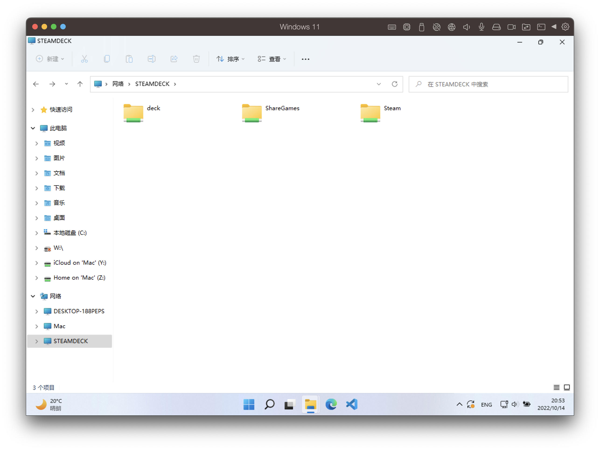
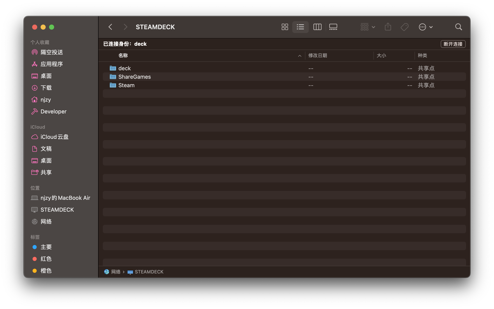
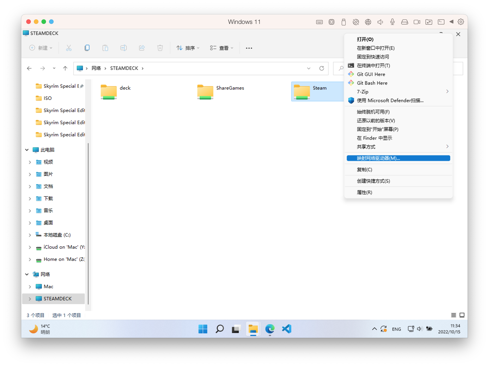
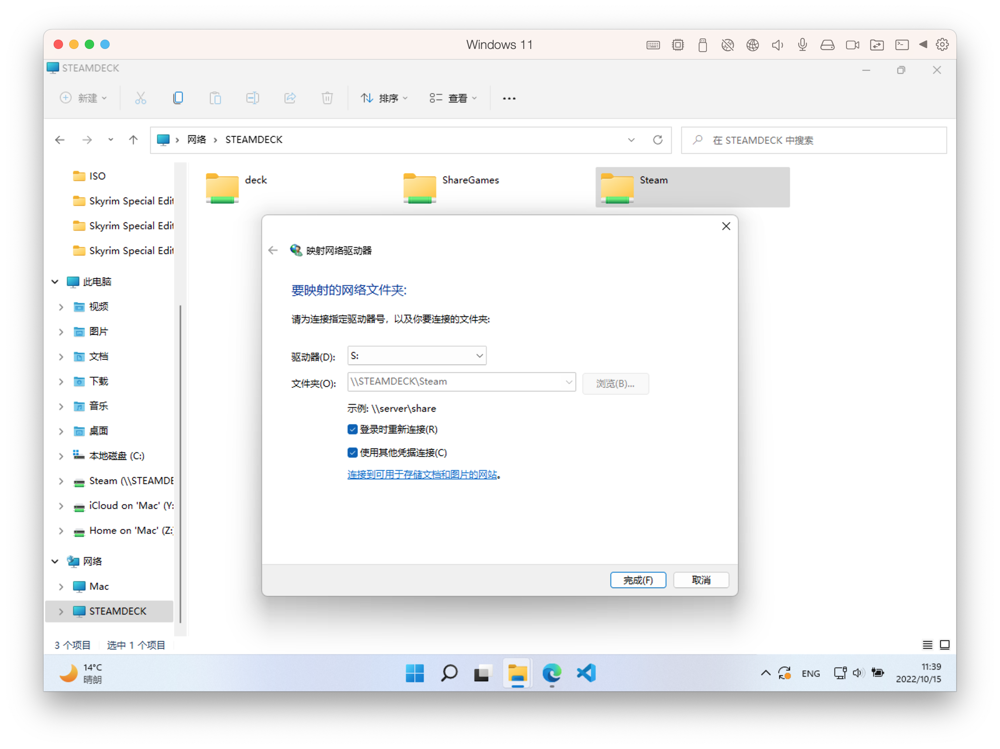
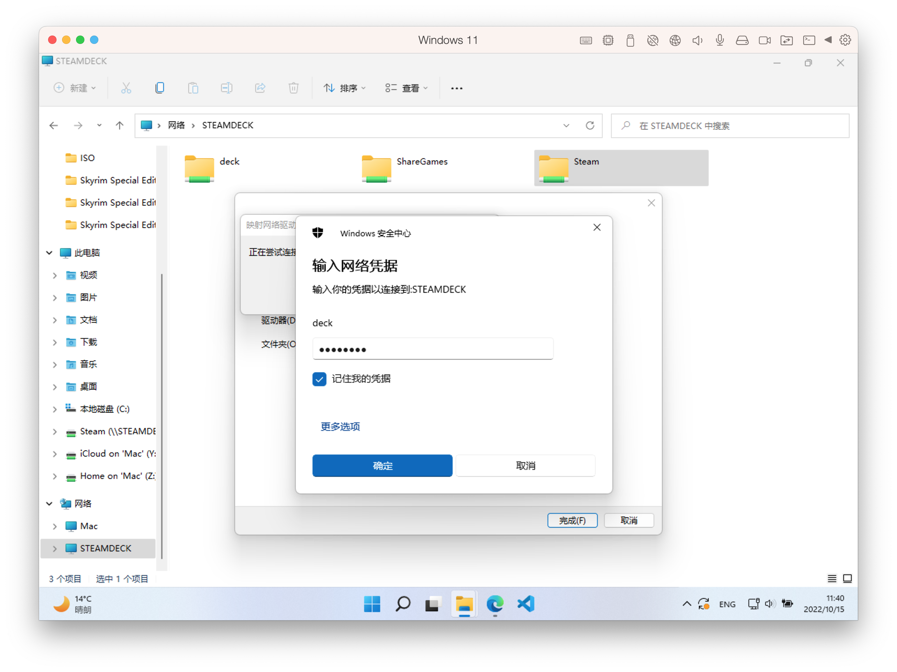
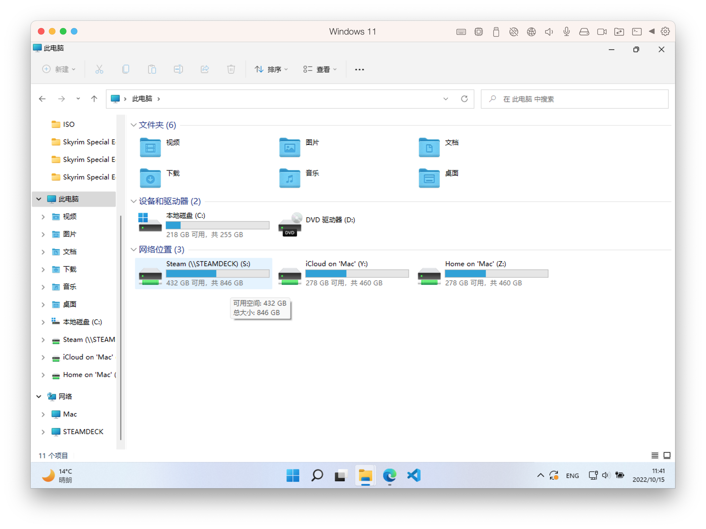

在 SteamDeck 上开启 Samba 实现文件共享，这样我们就可以更加方便的在 Windows 或者 macOS 上管理 SteamDeck 的文件，例如获取截图，复制存档或打 Mod 等等

## 安装

首先要确保可以正常使用 `pacman` ，具体可以参考我之前的  [SteamDeck 开启 SSH 并安装 Docker](../steamdeck-install-ssh-docker/index.md)  教程，这里不再赘述

我们切换到桌面模式并打开 `Konsole` 终端程序执行以下命令：

```bash
sudo pacman -S samba
```

## 设置配置文件

`samba` 默认不提供相关配置文件，我们执行以下命令开始手动设置相关配置：

```bash
sudo vim /etc/samba/smb.conf
```

配置的具体内容大家可以直接复制我这个, 如果要进行更为详细的配置，可参考官方的[示例文件](https://git.samba.org/samba.git/?p=samba.git;a=blob_plain;f=examples/smb.conf.default;hb=HEAD)：

```bash
[global]
   workgroup = WORKGROUP
   server string = Samba Server
   server role = standalone server

[homes]
   comment = Home Directories
   browseable = no
   writable = yes

[Steam]
   path = /home/deck/.local/share/Steam
   writable = yes

# 如果设置了游戏共享库，可以将下面的注释去掉，path 改成共享库的路径
;[ShareGames]
;   path = /run/media/shareGames
;   writable = yes
```

上面的配置我们主要共享了两个共享文件夹：

- homes - 用户主目录
- Steam - Steam 客户端目录

通过上面共享的文件夹，我们就可以在其他操作系统上访问以下目录了：

- 游戏安装目录 - `/home/deck/.local/share/Steam/steamapps/common`
- 游戏存档 - `/home/deck/.local/share/Steam/steamapps/compatdata/游戏ID/pfx/drive_c/users/steamuser/Documents/My%20Games/游戏名称`
- 游戏设置 - `/home/deck/.local/share/Steam/steamapps/compatdata/游戏ID/pfx/drive_c/users/steamuser/AppData/Local/游戏名称`
- 通过Steam截图的目录 - `/home/deck/.local/share/Steam/userdata/用户ID/760/remote`

## 添加 `samba` 用户

```bash
# 添加用户 deck 为 SteamDeck 默认的用户名
sudo smbpasswd -a deck
# 设置用户名密码
sudo smbpasswd deck
```

## 开启服务

通过以下命令开启服务并设置开机自启：

```bash
systemctl start smb
systemctl enable smb
```

此时我们其实已经可以访问了，但是如果此时访问 Windows 系统里的网络目录，你是看不到 SteamDeck 的，这里我们可以通过安装 `wsdd` 解决：

```bash
sudo pacman -S --needed base-devel
sudo pacman -S yay
yay -S wsdd
```

启动 `wsdd` 并设置开启自启：

```bash
systemctl start wsdd
systemctl enable wsdd
```

这样你就可以在 Window 的网络目录里看到相关的共享文件了：


 macOS 同样可以正常访问：


## Windows 映射网络驱动器

为了更加方便共享的文件夹，我们可以将其映射到本地的驱动器上。我们选中要挂载的文件夹，鼠标右键选择映射网络驱动器：


这里我们分配驱动器编号为S盘并勾选使用其他凭据连接：


点击完成需要我们输入用户密码，这里就是之前设置的 `smb` 用户密码：


点击确定就可以看到文件夹被挂载到磁盘中了：

