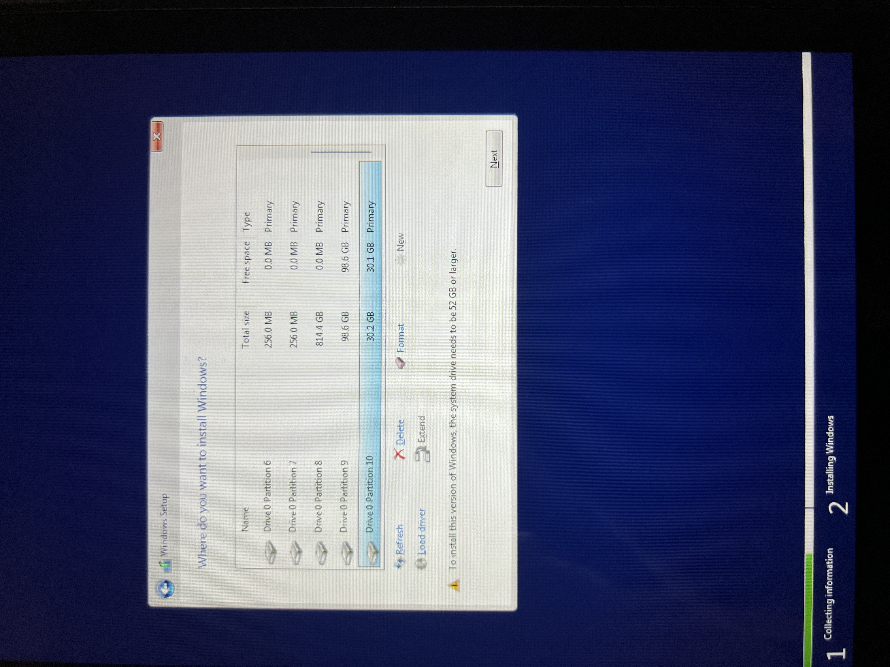

完整的 steamdeck windows 单盘双系统安装教程，包含 gparted 分区调整和 rEfind 双系统引导, 主要包含以下内容：

- 准备工作
- 磁盘分区
- Windows 系统安装
- rEFInd 双系统引导

## 准备工作

- U 盘
- [ventoy](https://www.ventoy.net/cn/download.html)
- [gparted iso 镜像](https://gparted.org/download.php)
- [windows11 iso 镜像](https://www.microsoft.com/zh-cn/software-download/windows11) - 这是官方的下载地址，下载出来的 ISO 为当前最新的 **22H2** 版本
- [SteamDeck windows 相关驱动](https://help.steampowered.com/en/faqs/view/6121-ECCD-D643-BAA8) - 如果之前下载过，记得重新检查一下声卡驱动是否是最新的，**官方 10 号更新了声卡驱动适配了最新的 22H2**

上述资源的链接都是官方链接，大家可以放心下载，全部准备完成后需要将 `ventoy` 安装至 U 盘，[官方有详细的安装教程](https://www.ventoy.net/cn/doc_start.html)，我这里就不再赘述

`ventoy` 安装完成后，我们将其他的资源移动到 U 盘即可，最后将 U 盘插入 SteamDeck，关机并按住 `音量-` + `电源键` 开机，听到声音后仅松开电源键即可进入 `boot` 菜单

这里我们选择 U 盘，即可看到 `ventoy` 启动菜单

## 磁盘分区

首先我们进入 `gparted`:


一路回车，最后就可以进入 GUI：


通过上面的分区信息我们可以看到，最后的 `home` 未使用空间为 500G，我们要做的就是从其中拆分出两个分区：

- 30G 作为 Windows11 系统盘
- 100G 作为游戏安装盘

**PS** 我这里的分区方式仅作参考，大家可以根据自己的实际需求进行灵活调整, 我这里将游戏安装分区单独拆出来是为了方便后续与 SteamOS 共享游戏，且后续如果重装 Windows 系统也不会丢失游戏数据

首先选中 `home` 分区，右键选择 `Resize/Move`：


这里我们拆分出 30G 作为系统盘并点击确定按钮：


点击这里的 `Apply` 才会最终生效：


这里我们将其格式化成 `NTFS` 格式：


经过上述操作我们就拆分出来一个 30G NTFS 格式的分区：


同理，按照上面的操作，我们在拆分出一个 100G 的分区左右游戏安装盘，这里的格式大家也可以继续使用 `NTFS`, 下面图里的格式我后来重新改成了 `NTFS`，这样无论是在 Windows 下还是在 SteamOS 里都可以正常挂载


至此分区相关操作我们都完成了

## Windows 系统安装

完成上述分区操作后，我们重启重新进入 `ventoy` 启动菜单，这里我们直接选择 Windows 系统镜像：


这里我们选择专业版：


这里我们就选择之前拆分出来的 30G 系统分区即可：



后续大家就安装提示一直下一步即可：


系统安装完成后，我们按照官方 [`Steam Deck Windows Resource`](https://help.steampowered.com/en/faqs/view/6121-ECCD-D643-BAA8) 中的教程下载并安装相关驱动即可，这里也不再赘述

## rEFInd 双系统引导

完成 Windows 系统安装后，你会发现下次开机默认进入的是 Windows 系统，这里我们将使用 `rEFInd` 实现双系统引导

首先我们关机并按住 `音量-` + `电源键` 开机，听到声音后仅松开电源键即可进入 `boot` 菜单, 这里我们选择 `SteamOS` ，系统启动成功后，我们切换到桌面模式

为了后续一键安装脚本可以正常执行，这里建议打开 `Konsole` 终端程序先执行以下命令：

详细过程可见 [在 steamdeck 上开启 ssh 实现远程连接](../steamdeck-install-ssh-docker/index.mdx)

```bash
# 设置默认登录账号 deck 的密码
passwd
# 设置 root 账号的密码
passwd root
# 关闭系统磁盘只读权限
sudo steamos-readonly disable
```

现在我们检查一下 `EFI` 分区以下内容是否存在，正常情况下都会存在以下目录的：

- `esp/efi/steamOS`
- `esp/efi/Microsoft` - 安装完 Windows 之后会自动生成，大家如果之前看过 YouTube 上的相关的教程会发现这里可能要求我们对其进行重命名或者执行其他修改操作，**这里我们不需要执行任何操作，保持默认即可，如果执行了其他操作可能会导致后续 Windows 系统更新失败**


检查完成后，我们执行以下命令进行 `rEFInd` 的安装：

```bash
# 拉取 jlobue10 开发的一键安装脚本
git clone https://github.com/jlobue10/SteamDeck_rEFInd/
# 进入脚本目录
cd SteamDeck_rEFInd
# 设置脚本权限
chmod +x SteamDeck_rEFInd_install.sh
# 执行脚本
./SteamDeck_rEFInd_install.sh
```


提示成功之后，我们直接重启就可以看到 `rEFInd` 的引导菜单，默认 5s 不进行操作会进入 `steamos`:


