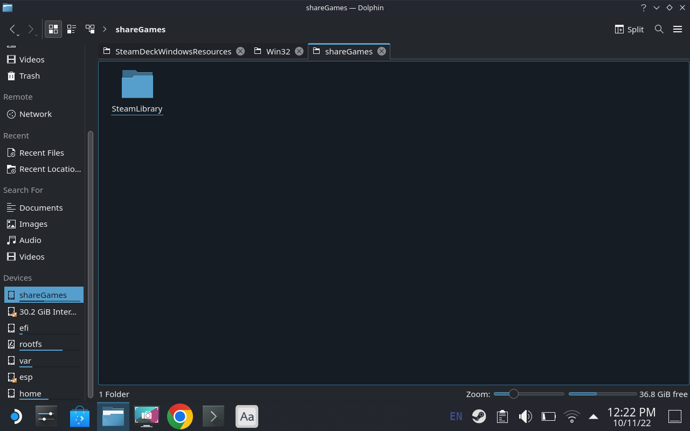

完整的 SteamDeck Windows 和 Steamos 共享游戏库教程，实现 Windows 和 steamos 可以运行同一个分区上的游戏，避免重复下载安装

如何安装双系统可见我之前的教程 [SteamDeck Windows 单盘双系统安装教程](../steamdeck-windows-dual-boot/index.md)，在此教程里我已经准备了一个游戏安装的分区，下面我们开始正式进入共享游戏库教程

## Windows 游戏库设置

我们重启进入 Windows 系统之后，首先打开文件管理器，这里我们将对单独拆分出来的游戏安装分区进行重命名

选中磁盘分区，右键点击属性，即可进行重命名，我这里会命名为：**shareGames**


之后我们打开 steam 并设置游戏库，游戏库设置页的打开路径为：`设置 -> 下载 -> 内容库`

我们点击 **+** 号添加即可，添加之后点击下面的三个点号即可将其设置为默认，下面的截图，我已经设置好了游戏库，并安装了 3 个游戏：


至此我们已经完成了 Windows 系统下的相关设置

## Steamos 游戏库设置

我们重启进入 steamos , 并切换到桌面模式

此时我们打开文件管理器，会发现 shareGames 分区且此时处于没有挂载的状态

我们打开 `Konsole` 终端程序，编辑 `/etc/fstab` 文件实现开启自动挂载：

```bash
# 创建挂载目录
sudo mkdir -p /run/media/shareGames
# 编辑 fstab 文件
sudo vim /etc/fstab
```

在文件最后部分添加此内容即可完成自动挂载：

```bash
LABEL=shareGames /run/media/shareGames ntfs defaults,nofail 0 0
```

**PS**: 这里的 `LABEL=shareGames` 就是我们之前在 windows 下重命名的名称, 如果后续我们重新调整分区大小，只要保证名称不变就可以正常自动挂载，后面的 `/run/media/shareGames` 是挂载目录，`ntfs` 为分区格式，如果这些大家跟我不一样，要记得灵活调整，其他内容可以保持不变, 至于其他参数的意义可见 [wiki.archlinux.org/title/Fstab](<https://wiki.archlinux.org/title/Fstab_(%E7%AE%80%E4%BD%93%E4%B8%AD%E6%96%87)>)


保存成功后，我们执行以下命令就可以立即生效，以后重启也会自动挂载：

```bash
sudo mount -a
```

此时我们打开文件管理器，就会发现 `shareGames` 已经成功挂载：



下面我们就可以打开 steam 设置游戏库了，操作步骤跟之前的 windows 一致：


至此我们就实现了 steamos 可以与 windows 运行同一个分区上的游戏，避免重复下载安装

## 注意事项

因为我实际共享的游戏不多，这里简单说下我目前遇到的问题和相关的解决方式

### 优先在 windows 系统下下载共享游戏

首先大家如果要共享游戏，尽量先在 windows 系统下下载，因为 windows 下下载的游戏基本只会是 windows 系统可运行的，如果在 steamos 里可能会下到 linux 原生支持的游戏，这样如果你在 windows 下运行这个游戏肯定是失败的

### 游戏移动

steam 自带的游戏移动功能是可以正常使用的，大家只要保证此游戏非 linux 原生支持的游戏即可, 上面图里共享的游戏: **Aperture Deck Job** 和 **Inside** 就是我使用移动功能移动到共享库的

### Windows 下可运行，但 Steamos 运行失败

我目前遇到的游戏就是 **生化奇兵：无限**, 解决方式参考的是 **[protondb](https://www.protondb.com/app/8870)** 上的教程，修改启动参数为：

```bash
eval $( echo "%command%" | sed "s/2KLauncher\/LauncherPatcher.exe'.*/Binaries\/Win32\/BioShockInfinite.exe'/" )
```


这个原理就是将默认的启动程序由 **2K 自身的启动器** 改成原始的启动程序 **BioShockInfinite.exe**

改完之后我发现并没有立即生效，我后面重新校验了一下游戏文件并重启系统才生效


所以有遇到此问题的小伙伴，可以试试我这种办法，优先在 **[protondb](https://www.protondb.com)** 上寻找解决方案
