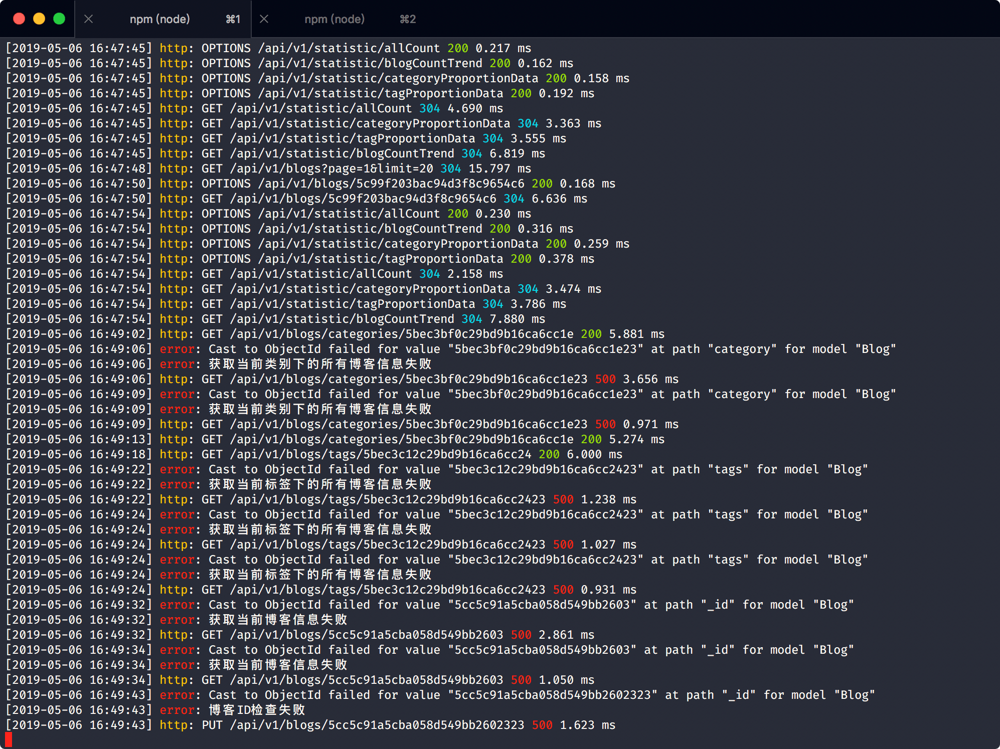
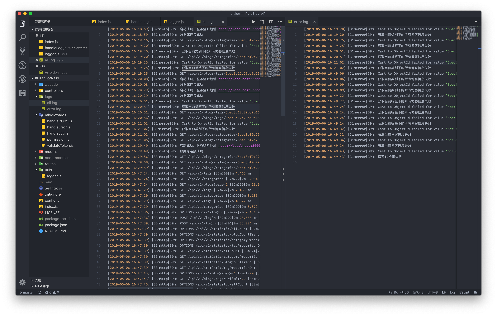

最近忙着做毕业设计，项目是一个多用户博客程序。后端技术栈为 express+mongodb，为了能够更为详细的记录程序运行日志，便开始研究如何使用 winston 和 morgan。项目代码已托管到 GitHub，感兴趣的同学可以看一下：[PureBlog-API](https://github.com/njzydark/PureBlog-API)

## 效果

可以在终端中显示所需要的日志信息



可以以文件的形式存储日志



## 实现步骤

winston 和 morgan 的详细使用方法大家还是以官方文档为准，我下面只是简要介绍我是如何使用的。

1. 安装 winston 和 morgan

   ```bash
   npm install --save winston morgan
   ```

2. 创建 logger

   - 先判断项目根目录是否存在 logs 文件夹，不存在则创建。
   - 配置日志等级和颜色
   - 配置日志以文件存储是的等级和文件名
   - 自定义日志格式
   - 创建 stream 用于添加 morgan 的 Http 请求日志信息

   代码实现如下：

   ```javascript
   const path = require('path');
   const fs = require('fs');
   const { createLogger, format, transports, addColors } = require('winston');

   // 确保项目根目录存在logs文件夹
   const logDirectory = path.resolve('./', 'logs');
   fs.existsSync(logDirectory) || fs.mkdirSync(logDirectory);

   // 配置等级和颜色
   const config = {
     levels: {
       error: 0,
       debug: 1,
       warn: 2,
       data: 3,
       info: 4,
       verbose: 5,
       silly: 6,
       http: 7,
     },
     colors: {
       error: 'red',
       debug: 'blue',
       warn: 'yellow',
       data: 'grey',
       info: 'green',
       verbose: 'cyan',
       silly: 'magenta',
       http: 'yellow',
     },
   };

   // 添加自定义颜色
   addColors(config.colors);

   const options = {
     allLog: {
       level: 'http',
       filename: path.resolve(logDirectory, 'all.log'),
     },
     errorLog: {
       level: 'error',
       filename: path.resolve(logDirectory, 'error.log'),
     },
   };

   function formatParams(info) {
     let { timestamp, level, message } = info;
     message = message.replace(/[\r\n]/g, '');
     return `[${timestamp}] ${level}: ${message}`;
   }

   const logger = createLogger({
     level: 'http',
     levels: config.levels,
     handleExceptions: true,
     json: true,
     maxsize: 5242880, // 5MB
     maxFiles: 5,
     format: format.combine(
       format.colorize(),
       format.timestamp({ format: 'YYYY-MM-DD HH:mm:ss' }),
       format.printf(formatParams)
     ),
     transports: [new transports.File(options.allLog), new transports.File(options.errorLog), new transports.Console()],
   });

   // 添加morgan日志信息
   logger.stream = {
     write: function (message, encoding) {
       logger.http(message);
     },
   };

   module.exports = logger;
   ```

3. 创建 morgan 日志处理中间件

   ```javascript
   const morgan = require('morgan');
   const logger = require('../utils/logger');

   // 解决自定义格式时响应时间不着色的问题
   morgan.token(`status`, (req, res) => {
     const status = (typeof res.headersSent !== `boolean` ? Boolean(res._header) : res.headersSent)
       ? res.statusCode
       : undefined;
     // get status color
     const color =
       status >= 500
         ? 31 // red
         : status >= 400
         ? 33 // yellow
         : status >= 300
         ? 36 // cyan
         : status >= 200
         ? 32 // green
         : 0; // no color
     return `\x1b[${color}m${status}\x1b[0m`;
   });

   const devModify = ':method :url :status :response-time ms';
   const combinedModify = ':remote-addr :method :url :status :response-time ms :user-agent"';
   const morganFormat = process.env.NODE_ENV == 'development' ? devModify : combinedModify;

   module.exports = morgan(morganFormat, { stream: logger.stream });
   ```

4. 使用 morgan 日志处理中间件

   ```javascript
   const handleLog = require('./middlewares/handleLog');

   app.use(handleLog);
   ```

5. 完成以上步骤，morgan 的日志信息便可以显示出来。当我们需要自己的日志时，需要引入 logger，并使用 logger.info 或者 logger.error 等方法。

   这是我在常规的业务逻辑中记录日志：

   ```javascript
   async getAllTags(req, res, next) {
     try {
       const tags = await Tag.find().exec()
       res.status(200).send({
         success: true,
         data: tags
       })
     } catch (e) {
       logger.error(e.message)
       next(new Error(`获取所有标签信息失败`))
     }
   }
   ```

   这是我在错误处理中间件中统一对错误进行记录：

   ```javascript
   const logger = require('../utils/logger');

   // 错误捕捉
   module.exports = (err, req, res, next) => {
     logger.error(err.message);
     res.status(500).send({
       success: false,
       message: err.message,
     });
   };
   ```

## 参考链接

[winston](https://github.com/winstonjs/winston)

[morgan](https://github.com/expressjs/morgan)

[express-combine-morgan-and-winston/](https://jojozhuang.github.io/tutorial/nodejs/express-combine-morgan-and-winston/)
